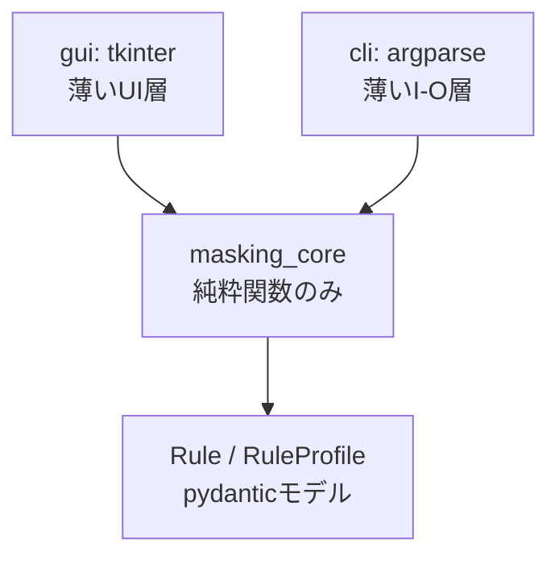

# CLAUDE.md

このファイルはClaude Codeがこのリポジトリで作業する際に従うべき方針をまとめたものです。

## プロジェクト概要

**アプリ名: SensitiveMasker**

SIP/FreeSWITCHログに限らず、電話番号・パスワード・IPアドレス等の機微情報を含む任意のテキスト
(ログ・コンソール出力等)を、Claudeなど外部に貼り付ける前にローカルで自動マスキングするための
Windowsデスクトップツール。GUI(tkinter)とCLIの両方を提供し、コアのマスキングロジックは両者から共有される。

**重要**: このツール自体が「機微情報を外部に漏らさないため」に作られている。実装・テストの過程で
本物のログや実データを一切使わないこと(後述の「テストデータポリシー」を厳守)。

## 技術スタック

- Python 3.12+
- **uv**: パッケージ管理・実行(`uv sync`, `uv run ...`)。venvの手動管理はしない
- **pydantic**: ルール定義(`Rule`, `RuleProfile`)のスキーマ定義とバリデーション
- **pytest**: テスト実行
- **tkinter**: GUI(標準ライブラリ、追加依存なし)
- **argparse**: CLI

## ディレクトリ構成

```
sensitive_masker/
  pyproject.toml
  CLAUDE.md
  README.md
  src/
    masking_core/
      __init__.py
      models.py        # pydanticモデル(Rule, RuleProfile)
      matcher.py        # literal/regexマッチング(純粋関数)
      masker.py          # ルール適用パイプライン, MappingStore
      profile_io.py       # プロファイルJSONの読み込み/保存
    cli/
      __init__.py
      main.py            # argparseエントリポイント
    gui/
      __init__.py
      app.py              # tkinterエントリポイント(ウィジェット/ダイアログ)
      settings.py         # 表示ラベル・テンプレート定義(純粋データ、tkinter非依存)
  tests/
    test_models.py
    test_matcher.py
    test_masker.py
    test_profile_io.py
    test_cli.py
    test_gui_templates.py  # gui/settings.pyのテンプレートデータ検証(表示なしで実行可能)
    fixtures/
      synthetic_logs.py  # 合成ダミーログ(実ログ使用禁止)
  rules/
    .gitkeep               # ユーザーが保存/インポートするプロファイルの置き場(既定では空)
  packaging/
    run_cli.py / run_gui.py                       # PyInstallerエントリスクリプト
    SensitiveMasker.spec / SensitiveMaskerCLI.spec  # PyInstaller onefileビルド設定
  scripts/
    generate_icon.py       # アプリアイコン生成(devのみ、Pillow使用)
  assets/
    icon.ico                # 生成済みアプリアイコン
```

## アーキテクチャ原則(疎結合)

依存の方向は常に「外側 → masking_core」の一方向。`masking_core`はGUI/CLIの存在を一切知らない。



- `masking_core`は**Functional Core**: 副作用(ファイルI/O、クリップボード、標準入出力、GUI描画)を持たない
- ファイルの読み書きや標準入出力は`cli`/`gui`側(**Imperative Shell**)の責務
- 対応表(`MappingStore`: 元の値→ダミー値)は`masking_core`内で状態として保持せず、呼び出し側から渡す/受け取る形にする(グローバル状態を作らない)。これによりバッチ変換で複数ファイルにまたがって同じ`MappingStore`を使い回すか、ファイルごとにリセットするかを呼び出し側で自由に選べる
- `pydantic`モデル(`Rule`, `RuleProfile`)は`masking_core.models`にのみ定義し、GUI/CLIはこのモデルを介してのみデータをやり取りする(GUI/CLI側で独自にdictを組み立てて渡さない)
- GUIとCLIの間には依存関係を作らない(どちらかがもう一方を呼び出すことはしない)

## 開発手法

- **masking_core**: 通常のTDD(Red-Green-Refactor)。厳密に行う
  - 肯定テストだけでなく、**否定テスト**(マスクされてはいけない箇所が誤って消えていないか)を必ず対にする
  - ルール適用順序による多重マスクや、`pattern_type="literal"`での正規表現特殊文字の扱いなど、境界条件を重点的にテストする
- **cli**: I/O中心の結合テスト(標準入出力・ファイル入出力・複数ファイルのバッチ処理)
- **gui**: tkinterウィジェットを組み立てる`app.py`自体は自動テストを行わない。各機能を実装するたびに、
  都度手動確認チェックリストを実施する(チェックリストの内容は実装が進む都度、該当機能に合わせて提示する)。
  ただし表示ラベルやテンプレート定義など`app.py`から切り出した純粋データ(`gui/settings.py`)は、
  tkinter非依存のため通常のpytestで自動テストしてよい
- **コミット粒度**: 固定ルールは設けず、実装の区切りごとにClaudeが適切な粒度を提案する

## テストデータポリシー(厳守)

- テストコード・fixtureに**実際のSIPログ、実際の電話番号、実際のIPアドレス等を一切含めない**
- テストデータは`tests/fixtures/synthetic_logs.py`に架空の合成データとしてのみ定義する
  (例: 電話番号は`0120XXXXXX`のような明らかにダミーとわかる値、IPは`203.0.113.0/24`等のドキュメント用予約アドレス帯を使う)
- 新しいテストを追加する際、実データっぽい値をそのままコピー&ペーストしていないか毎回確認する

## コマンド一覧

```bash
uv sync                          # 依存関係のインストール
uv run pytest                    # 全テスト実行
uv run pytest tests/test_masker.py -v  # 個別テスト実行
uv run python -m cli.main --profile my_profile.json --input in.log --output out.log
uv run python -m gui.app         # GUI起動
```

## 実装時の注意点

- ルール(`Rule`)の`mode="fixed"`時は`fixed_value`必須、`mode="random"`時は`prefix`必須。
  この整合性チェックは`pydantic`の`model_validator`でモデル定義時点に持たせ、
  呼び出し側(GUI/CLI)でif分岐による二重チェックをしない
- ランダムモードのダミー値プレフィックスは、元ログ中に出現しないことが保証された文字列にする
  (例: `__MASK_PHONE_1__`のような衝突しにくい形式)
- バッチ変換時、`MappingStore`をファイル間で共有するかリセットするかは呼び出し側(cli/gui)の判断とし、
  `masking_core`側では強制しない
