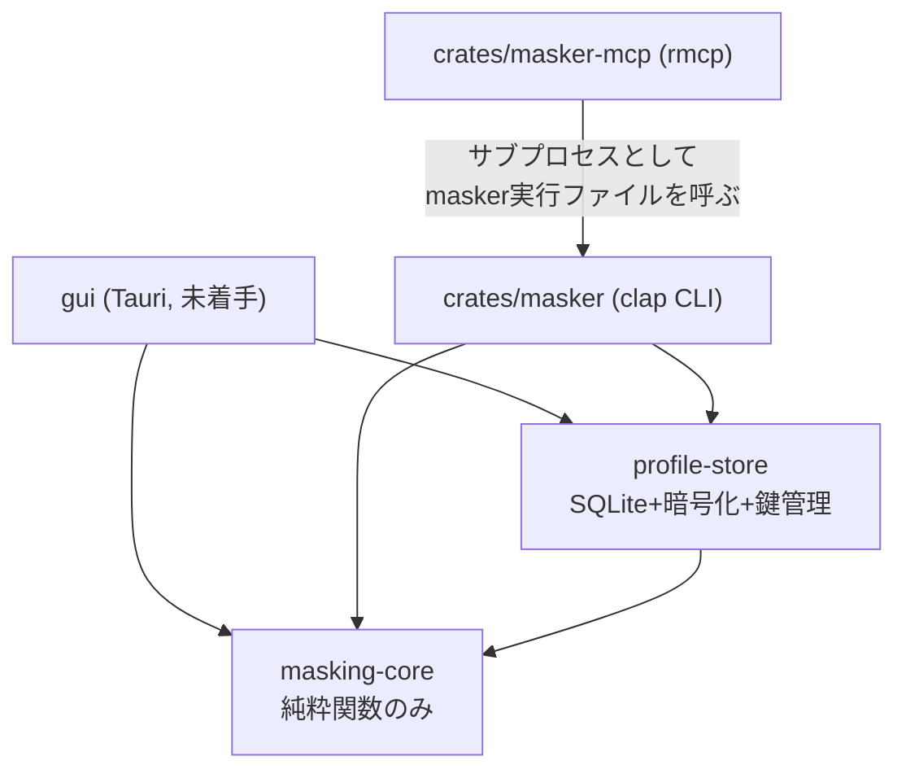

# CLAUDE.md

このファイルはClaude Codeがこのリポジトリで作業する際に従うべき方針をまとめたものです。

## プロジェクト概要

**アプリ名: SensitiveMasker**

電話番号・パスワード・IPアドレス等の機微情報を含む任意のテキスト(ログ・コンソール出力等)を、
外部LLMに貼り付ける前にローカルで自動マスキングするツール。GUI(Tauri)・CLI(`masker`)・MCPサーバーの
3つのインターフェースを提供し、コアのマスキングロジックは全てから共有される。

## 技術スタック

- Rust(edition 2024)、Cargo workspace(各crateは`edition.workspace = true`でルートの`[workspace.package]`を継承)
- **masking-core**: 副作用のない純粋ロジック。`serde`(モデル定義)、`regex`(マッチング)、`thiserror`(エラー型)
- **profile-store**: SQLite永続化+暗号化+鍵管理。`rusqlite`(bundled)、`chacha20poly1305`(プロファイル本体の暗号化)、
  `secrecy`(鍵の保持)、`age`(エクスポート/インポートのパスフレーズ再暗号化、未実装)、`rand`、`dirs`
- **masker**(CLI): `clap`
- **masker-mcp**: `rmcp`(公式Rust SDK, stdioトランスポート)、`tokio`
- **gui**: Tauri v2(フロントエンドフレームワーク未選定)

## ディレクトリ構成


```mermaid
flowchart TD
    G["gui (Tauri, 未着手)"] --> CORE["masking-core<br>純粋関数のみ"]
    C["crates/masker (clap CLI)"] --> CORE
    M["crates/masker-mcp (rmcp)"] -->|サブプロセスとして<br>masker実行ファイルを呼ぶ| C
    G --> PS["profile-store<br>SQLite+暗号化+鍵管理"]
    C --> PS
    PS --> CORE
```

```
SensitiveMasker/
  Cargo.toml              # workspace root
  crates/
    masking-core/          # Rule/RuleProfile, matcher, masker(apply_profile), MappingStore
    profile-store/         # SQLite, 暗号化, 鍵ファイル管理, export/import
    masker/                 # CLIエントリポイント(バイナリ名 masker)
    masker-mcp/              # MCPサーバー(run_masked_commandツール)
  gui/                      # Tauriアプリ(未作成)
  poc/                      # 使い捨てのPoC用(workspaceのmemberに含めない)
```

## アーキテクチャ原則(疎結合)

依存の方向は常に「外側 → masking-core」の一方向。`masking-core`はgui/cli/mcpの存在を一切知らない。

- `masking-core`は**Functional Core**: 副作用(ファイルI/O、DB、暗号化、標準入出力、GUI描画)を持たない
- DB・暗号化・鍵ファイルI/Oは`profile-store`の責務(**Imperative Shell**側だが、gui/cli/mcpで
  重複させないよう共有ライブラリとして切り出す)
- `masker-mcp`は`masking-core`/`profile-store`に依存しない。対象コマンドの出力を
  `masker mask --stream`にパイプするだけの薄い層(サブプロセス呼び出し)であるため
- gui/cli/mcpの間には依存関係を作らない(同一バイナリに統合しない。Windowsでは`windows_subsystem`の
  コンソール/GUI切り替えの制約上、CLIとGUIは別バイナリである必要がある)

## セキュリティ設計

- ルールプロファイルはSQLite内で`chacha20poly1305`により対称暗号化して保存する(`rules_encrypted`+
  `nonce`列)。AAD(プロファイル名)を束ねる
- 復号鍵は`secrecy::SecretBox`で保持し、DBと別ファイルに分離してOSファイル権限
  (Unix chmod 600 / Windowsは`icacls`)で所有ユーザーのみに制限する
- OSキーチェーン(keyring/DPAPI/Keychain)は不採用
- 未初期化(鍵/DB不在)時は`mask`等をエラーで停止する(fail-safe defaults)
- エクスポート/インポートは`age`クレートによるパスフレーズ再暗号化(`age -p`相当、未実装)
- 保存先パスのbundle identifierは`io.github.akutori.sensitivemasker`
  (`crates/profile-store/src/paths.rs`)。GUI側の`tauri.conf.json`の`identifier`と一致させる必要がある

## 開発手法

- **masking-core**: TDD(Red-Green-Refactor)。肯定テストと否定テストを対にする
- **profile-store**: 実ファイルI/O・実DBを使った結合テスト中心(モックしない)
- ロジックを伴う実装(機能追加・修正・リファクタリング)では`adversarial-verification` Skillの
  「実装計画 → 実装 → 敵対的検証 → 修正」ループに従う

## テストデータポリシー(厳守)

- テストコード・fixtureに**実際のログ、実際の電話番号、実際のIPアドレス等を一切含めない**
- テストデータは架空の合成データとしてのみ定義する(電話番号は`0120XXXXXX`のような明らかにダミーと
  わかる値、IPは`203.0.113.0/24`等のドキュメント用予約アドレス帯を使う)

## PoCポリシー

- 既存コード・ブランチの文脈に依存する検証はgit worktreeで実施する
- 完全に新規/単体の独立した機能検証は、workspaceのmemberに含めない`poc/`直下の
  使い捨てフォルダで実施する
