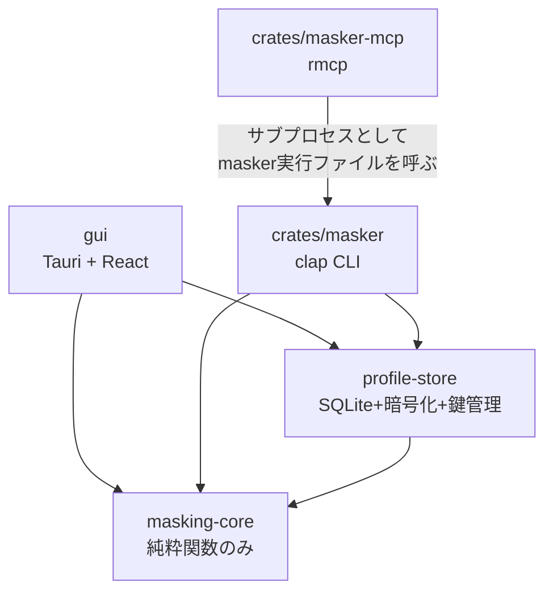

# CLAUDE.md

このファイルはClaude Codeがこのリポジトリで作業する際に従うべき方針をまとめたものです。

## プロジェクト概要

**アプリ名: SensitiveMasker**

電話番号・パスワード・IPアドレス等の機微情報を含む任意のテキスト(ログ・コンソール出力等)を、
外部LLMに貼り付ける前にローカルで自動マスキングするツール。GUI(Tauri)・CLI(`masker`)・MCPサーバーの
3つのインターフェースを提供し、コアのマスキングロジックは全てから共有される。

## 技術スタック

- Rust(edition 2024)、Cargo workspace(各crateは`edition.workspace = true`でルートの`[workspace.package]`を継承)
- **masking-core**: 副作用のない純粋ロジック。`serde`(モデル定義)、`regex`(マッチング)、`thiserror`(エラー型)、
  `zeroize`(ルールの内容を、メモリ上で消去できるようにする。`Rule`・`RuleProfile`に`Zeroize`を実装する)
- **profile-store**: SQLite永続化+暗号化+鍵管理+export/import。`rusqlite`(bundled)、
  `chacha20poly1305`+`poly1305`(zeroize feature有効化、プロファイル本体の暗号化)、
  `secrecy`/`zeroize`(鍵・平文の保持と消去)、`age`(エクスポート/インポートのパスフレーズ再暗号化)、
  `zxcvbn`(パスフレーズ強度判定)、`rand`、`dirs`
- **masker**(CLI): `clap`
- **masker-mcp**: `rmcp`(公式Rust SDK, stdioトランスポート)、`tokio`、`rustix`(Unixのタイムアウト時に、
  プロセスグループへのSIGKILLをシステムコールで直接送る。外部の`kill`コマンドは使わない)
- **wipe-check**(テスト専用。masking-core・profile-storeのdev-dependencyのみ): メモリを消去してから解放したかを、
  解放の直前の中身で確かめる(`GlobalAlloc`のラッパー)
- **gui**: Tauri v2。フロントエンドはReact 19 + TypeScript + Vite + TanStack Router + Tailwind CSS v4 +
  shadcn/ui(Radix)、パッケージマネージャーは常にbun。Tauriプラグイン: `dialog`(ファイル選択)、
  `clipboard-manager`+`arboard`(クリップボード)、`notification`(トレイのエラー通知)、
  `autostart`(OSごとの自動起動)。E2Eテストは`tauri-plugin-wdio`(`e2e-testing` feature、配布ビルドには含めない)

## ディレクトリ構成


```mermaid
flowchart TD
    G["gui<br>Tauri + React"] --> CORE["masking-core<br>純粋関数のみ"]
    C["crates/masker<br>clap CLI"] --> CORE
    M["crates/masker-mcp<br>rmcp"] -->|サブプロセスとして<br>masker実行ファイルを呼ぶ| C
    G --> PS["profile-store<br>SQLite+暗号化+鍵管理"]
    C --> PS
    PS --> CORE
```

```
SensitiveMasker/
  Cargo.toml              # workspace root
  crates/
    masking-core/          # Rule/RuleProfile, matcher, masker(apply_profile), MappingStore
    profile-store/         # SQLite, 暗号化, 鍵ファイル管理, export/import
    masker/                 # CLIエントリポイント(バイナリ名 masker)
    masker-mcp/              # MCPサーバー(run_masked_commandツール)
    wipe-check/               # テスト専用: 消去してから解放したかの確認(dev-dependency)
  gui/                      # Tauriアプリ
    src/                     # React(コンポーネント・ルート・状態管理)
    src-tauri/                # Tauriコマンド・トレイ・クリップボード連携
    e2e/                       # WebDriverベースのE2Eテスト
  docs/cli/README.md         # masker CLIのコマンド仕様
  docs/gui/README.md         # GUIの画面・機能一覧
  docs/mcp/README.md         # masker-mcpのツール仕様
  poc/                      # 使い捨てのPoC用(workspaceのmemberに含めない)
```

## アーキテクチャ原則(疎結合)

依存の方向は常に「外側 → masking-core」の一方向。`masking-core`はgui/cli/mcpの存在を一切知らない。

- `masking-core`は**Functional Core**: 副作用(ファイルI/O、DB、暗号化、標準入出力、GUI描画)を持たない
- DB・暗号化・鍵ファイルI/Oは`profile-store`の責務(**Imperative Shell**側だが、gui/cli/mcpで
  重複させないよう共有ライブラリとして切り出す)
- `masker-mcp`は`masking-core`/`profile-store`に依存しない。対象コマンドの出力を
  `masker mask --stream`にパイプするだけの薄い層(サブプロセス呼び出し)であるため
- gui/cli/mcpの間には依存関係を作らない(同一バイナリに統合しない。Windowsでは`windows_subsystem`の
  コンソール/GUI切り替えの制約上、CLIとGUIは別バイナリである必要がある)

## セキュリティ設計

- ルールプロファイルはSQLite内で`chacha20poly1305`により対称暗号化して保存する(`rules_encrypted`+
  `nonce`列)。AAD(プロファイル名)を束ねる
- 復号鍵は`secrecy::SecretBox`で保持し、DBと別ファイルに分離してOSファイル権限
  (Unix chmod 600 / Windowsは`icacls`絶対パス指定)で所有ユーザーのみに制限する
- 鍵・平文JSON等の機微データは`zeroize`でdrop時に消去する。コピーを作ってから消すのではなく、
  そもそもコピーを作らない設計(借用ベースの構築、事前確保したヒープへの直接書き込み)を優先する
- OSキーチェーン(keyring/DPAPI/Keychain)は不採用
- 未初期化(鍵/DB不在)時は`mask`等をエラーで停止する(fail-safe defaults)
- エクスポート/インポートは`age`クレートによるパスフレーズ再暗号化(GUI側はアプリ生成の高エントロピー
  パスフレーズ、CLI側は手入力。`zxcvbn`でスコアが低い場合は警告する)
- 保存先パスのbundle identifierは`io.github.akutori.sensitivemasker`
  (`crates/profile-store/src/paths.rs`)。GUI側の`tauri.conf.json`の`identifier`と一致させる必要がある
- GUI(Tauri)はACL(`capabilities/default.json`、`build.rs`で自動生成)で全コマンドを個別許可制にし、
  CSP(`tauri.conf.json`)で外部への通信を遮断する
- WebView2の自動補完(Suggestions)は、入力欄の`autocomplete="off"`を守らない場合があるため、
  `tauri.conf.json`の`generalAutofillEnabled: false`で無効にする(入力欄の候補を残さない。パスワード・
  クレジットカードの自動補完は対象外。macOS/Linuxでは無視される)
- `monaco-editor`が同梱するDOMPurifyの写しは、脆弱性の対象の版のため、`gui/vite.config.ts`のプラグインで、npmの`dompurify`
  (`gui/package.json`の`overrides`で、修正済みの版に固定)へ差し替える(`vite build`の配布ビルドだけ。開発サーバーと
  Storybookの事前バンドルには効かない)。配布物に入った版が、npm版で、修正済みの版以上であることは`bun run check:dist`が確かめる
- `gui/package.json`の`overrides`は、配布物に含まれないE2E用ツール(mocha・wdio)の依存も、`bun audit`が報告する脆弱性の
  修正済みの版に固定している(上流が追随したら外す)
- 外部実行ファイル(`icacls`/`taskkill`)はPATH解決に頼らず`%SystemRoot%`から絶対パスを組み立てて呼ぶ

## 開発手法

- **masking-core**: TDD(Red-Green-Refactor)。肯定テストと否定テストを対にする
- **profile-store**: 実ファイルI/O・実DBを使った結合テスト中心(モックしない)
- **メモリの消去(zeroize)**: 値が論理的に空になったかだけでは、`clear()`や`= None`(中身を上書きせずに解放する)でも
  通ってしまうため、`wipe-check`で、追跡した文字列が、解放される直前に全て0であることを確かめる
- **gui**: Component-Driven Development(Storybookで個別コンポーネントを検証してから画面に組み込む)。
  主要フローは`gui/e2e/`のWebDriverベースE2Eテストで検証する
  - 画面(コンポーネント・操作の流れ)を変えたら、対応するStorybookのstory(playテスト)とE2Eを同じ変更で更新する
  - 状態遷移などReactに依存しない純関数は`gui/src/lib/*.test.ts`に置き、vitestの`unit`プロジェクト
    (`bun run test:unit`)で検証する。storyのplayテストは`storybook`プロジェクト(`bun run test:stories`)で実行する
  - OSのネイティブダイアログ(ファイル選択・保存)はWebDriverから操作できない。E2Eビルド(`VITE_E2E_TESTING`)に
    限り、`gui/src/lib/file-dialog.ts`が`window.__e2eFileDialogPaths`の値をダイアログの代わりに返す
    (本番ビルドには含まれない)
  - インポートの保留(Rust側の復号済みの内容)は、復号のたびに払い出す識別子で結び付け、確定・破棄はその識別子の
    保留だけに作用する(識別子を省略した破棄は、全ての保留を消す。E2Eの後片付け用で、画面は使わない)。画面の外から
    確定を直接呼ぶE2Eのために、E2Eビルドに限り、`gui/src/lib/e2e-pending-import.ts`が受け取った識別子を
    `window.__e2ePendingImportIds`へ残す(本番ビルドには含まれない)
  - インポートの保留の3コマンド(`preview_import`・`commit_pending_import`・`clear_pending_import`)の、引数・応答の
    キー名(IPCの境界)は、`tauri::test`の`MockRuntime`上で、実際のコマンドをJSONを通して呼ぶテスト
    (`gui/src-tauri/src/export_import.rs`のtests)で固定する(他のコマンドは、この方法では固定していない)。
    Windows(MSVC)のデバッグビルドでは、`gui/src-tauri/build.rs`が、comctl32 v6のマニフェストを、tauri-buildの
    リソースでなくリンカーで全ターゲットへ埋め込む(`tauri::test`でアプリを組み立てるテストの実行ファイルは、
    マニフェストが無いと、起動時に`STATUS_ENTRYPOINT_NOT_FOUND`で落ちるため)。リリースビルドは、tauri-buildの
    既定のまま(そのため、Windowsのリリースプロファイルでは、ライブラリ`gui_lib`の単体テストの実行ファイル全体が
    起動しない)
  - リリース(`.github/workflows/release.yml`)は、`verify.yml`(型検査・単体テスト・storyのplayテスト・
    `cargo test --workspace --locked`・配布用フロントエンドの検査`bun run check:dist`(E2E専用コードの混入と、DOMPurifyの版))に通った場合に限り公開する
- ロジックを伴う実装(機能追加・修正・リファクタリング)では`adversarial-verification` Skillの
  「実装計画 → 実装 → 敵対的検証 → 修正」ループに従う

## テストデータポリシー(厳守)

- テストコード・fixtureに**実際のログ、実際の電話番号、実際のIPアドレス等を一切含めない**
- テストデータは架空の合成データとしてのみ定義する(電話番号は`0120XXXXXX`のような明らかにダミーと
  わかる値、IPは`203.0.113.0/24`等のドキュメント用予約アドレス帯を使う)

## PoCポリシー

- 既存コード・ブランチの文脈に依存する検証はgit worktreeで実施する
- 完全に新規/単体の独立した機能検証は、workspaceのmemberに含めない`poc/`直下の
  使い捨てフォルダで実施する
